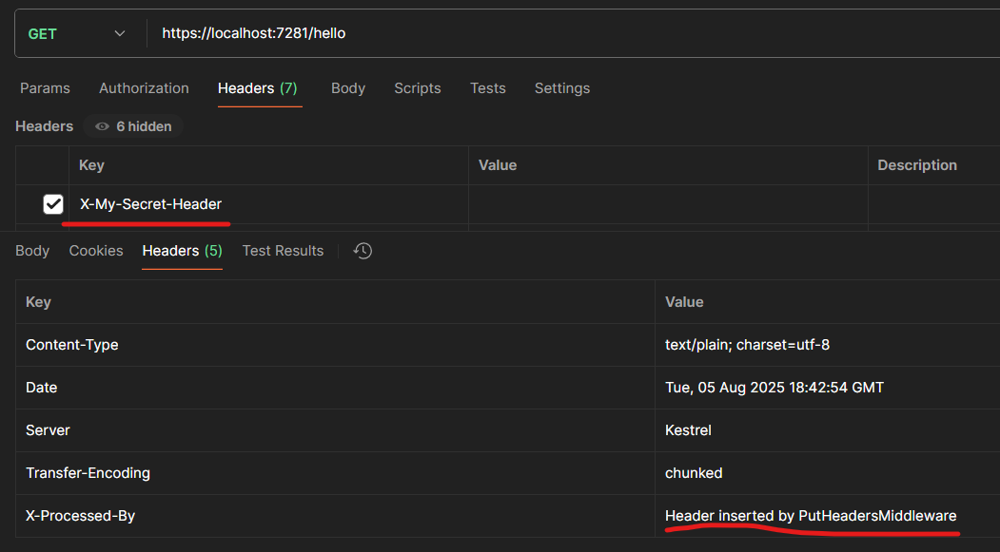
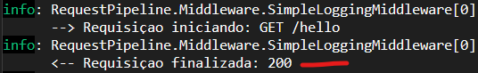
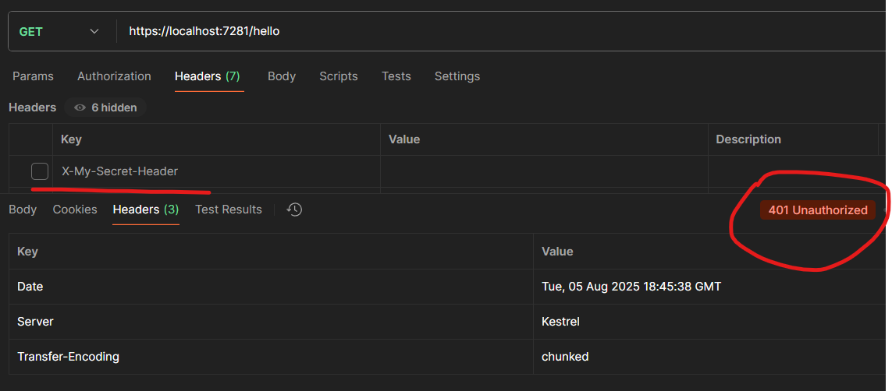
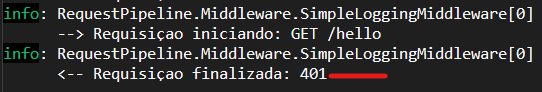

# 04 - Request Pipeline e Middlewares

Projeto de estudos da pipeline e middlewares, demonstrando a ordem dos middlewares na pipeline.

Foram criados 3 middlewares como exemplo:

1. SimpleLoggingMiddleware que faz um log simples de entrada e demonstra que a requisição é retornada, podem por exemplo fazer um log do status da resposta.
2. SecurityMiddleware um middleware que verifica a existência de um header, caso não exista o status code é alterado e o fluxo da pipeline é interrompida.
3. PutHeadersMiddleware apenas demonstrando que é possível alterar a resposta, nesse caso inseri um valor no header como exemplo.

## Resultados

Requisição para endpoint /hello com header de autorização inserido

Log do middleware SimpleLoggingMiddleware registrando o código de retorno.

Requisição para endpoint /hello sem header de autorização inserido.

Log do middleware SimpleLoggingMiddleware registrando o código de retorno.

