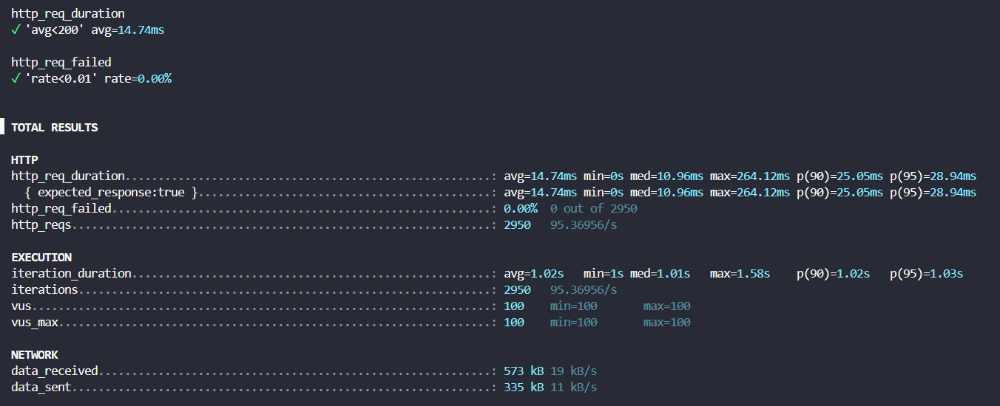
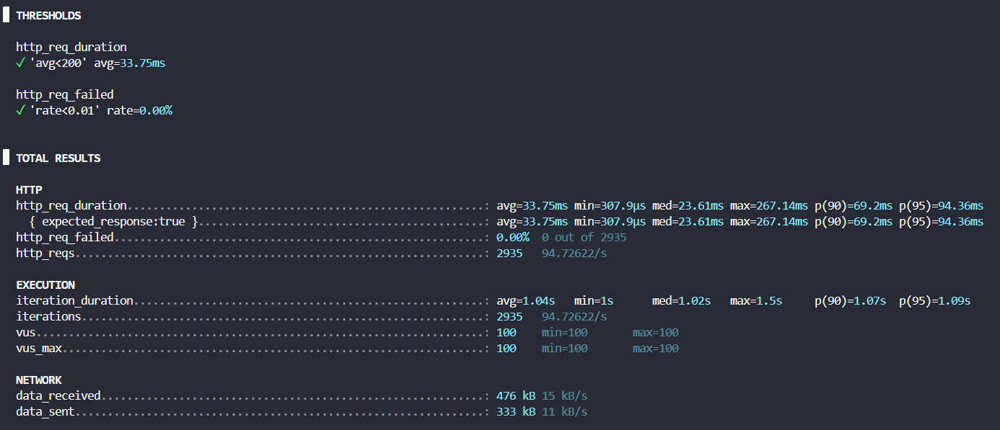

# 03 - Teste Stress com K6 e ciclo de vida de objetos

Projeto criado para estudar o comportamento do ciclo de vida de objetos injetados pelo container da Microsoft e realizar testes de carga e stress de APIS usando K6

## Instalando o K6

Por linha de comando

```
winget install k6
```

## Executando os testes

```
k6 run singleton_test.js
k6 run scoped_test.js
k6 run transient_test.js
```

## Resultados 

### Singleton



### Scoped




### Transient

